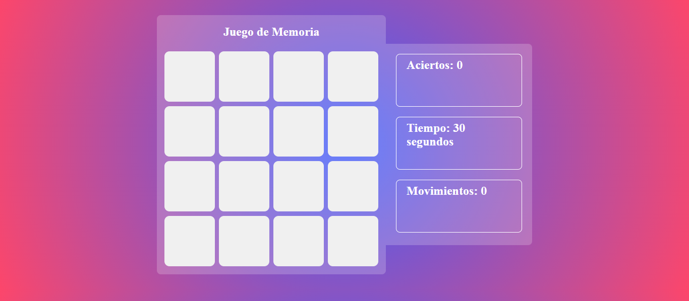
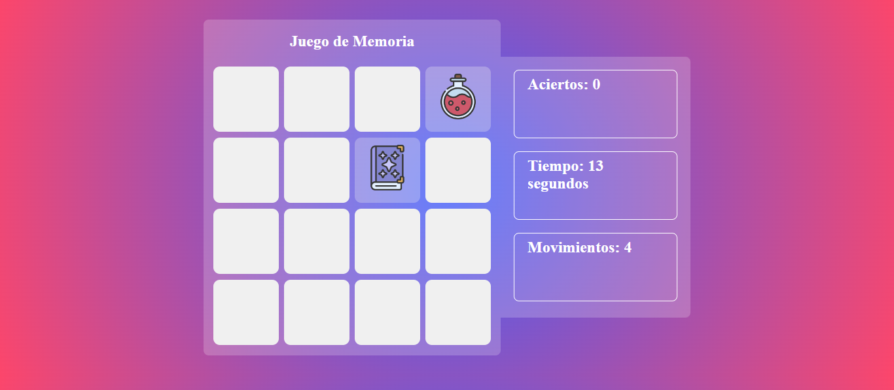
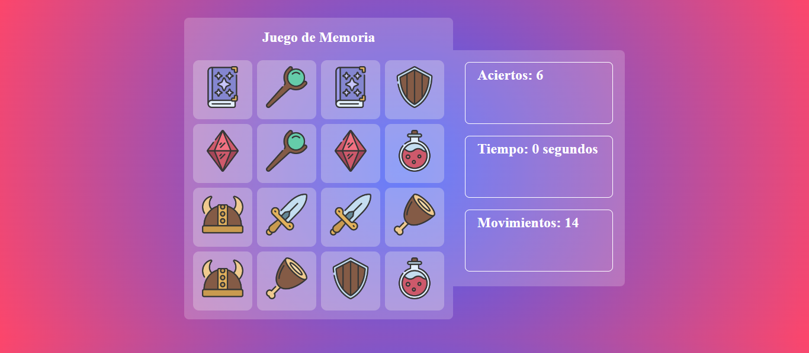
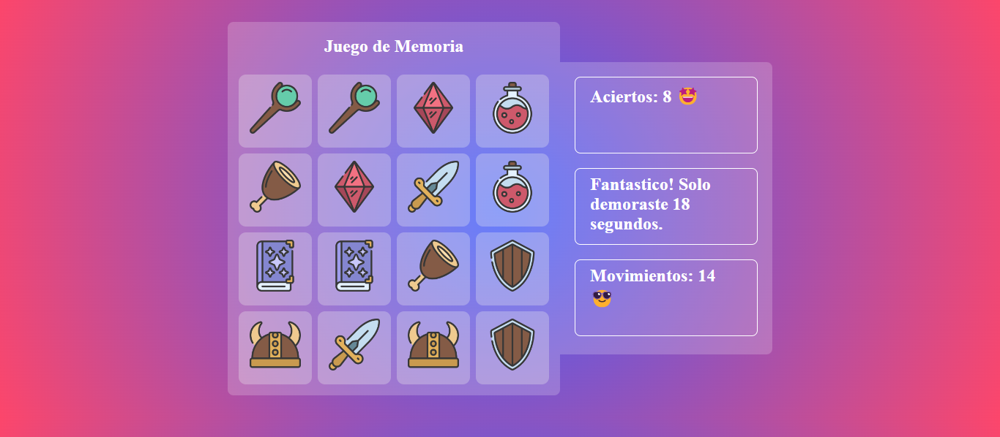

# Memory Game

Un juego de memoria interactivo donde los jugadores deben emparejar todas las cartas iguales en el menor tiempo posible. ¡Pon a prueba tu memoria y mejora tus habilidades con este divertido reto!

## Características

- Interfaz simple e intuitiva.
- Diseño responsive que se adapta a diferentes dispositivos.
- Temporizador para medir el tiempo de cada partida.
- Contador de movimientos para registrar la eficiencia del jugador.
- Reinicio del juego para intentar mejorar el tiempo y movimientos.

## Capturas de Pantalla


_Interfaz inicial del juego con las tarjetas ocultas y los contadores en cero._


_Momento durante el juego en el que el jugador ha descubierto algunas tarjetas. Los contadores muestran el progreso actual en términos de tiempo, movimientos y aciertos._


_Estado final del juego en el que el tiempo ha terminado y el jugador no pudo emparejar todas las tarjetas. Todas las tarjetas se revelan automáticamente para mostrar su ubicación, indicando el final de la partida._


_Estado final del juego cuando el jugador ha encontrado todas las parejas correctamente. Se muestra un mensaje de felicitación, junto con el número total de aciertos, movimientos realizados y el tiempo empleado._

## Instalación

1. Clona el repositorio:
    ```bash
    git clone https://github.com/lucas29951/memory-game.git
    ```

2. Navega hasta el directorio del proyecto:
    ```bash
    cd memory-game
    ```

3. Abre el archivo `index.html` en tu navegador favorito para comenzar a jugar.

## Uso

Simplemente abre el archivo `index.html` en tu navegador. Haz clic en las cartas para voltearlas y encuentra las parejas coincidentes. El juego termina cuando todas las cartas están emparejadas.

## Contribuciones

Si deseas contribuir a mejorar el juego, puedes hacer lo siguiente:

1. Haz un fork de este repositorio.
2. Crea una nueva rama (`git checkout -b feature/nueva-funcionalidad`).
3. Realiza tus modificaciones y haz commit (`git commit -m 'Agrega una nueva funcionalidad'`).
4. Envía tus cambios (`git push origin feature/nueva-funcionalidad`).
5. Crea un Pull Request en este repositorio.

## Contacto

Para sugerencias o comentarios, puedes contactarme a través de mi perfil de GitHub.

## Créditos

Este proyecto fue realizado en base al proyecto de [CodingTube](https://github.com/CodinGitHub). Agradezco al autor por compartir sus conocimientos y recursos.

Puedes encontrar el video de como realizarlo en el siguiente enlace: [Enlace del video](https://youtu.be/TMWkKPlUUJ4?list=PLCnOTSLuGRSFfA1mB3ILWZzDDRr69KCyR).


---

¡Gracias por jugar y contribuir!
